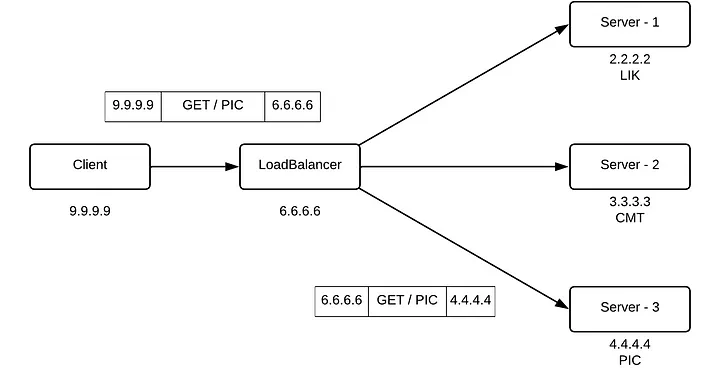

# Load balancer

## Load balancing problem

- As your backend gets more traffic, you’ll eventually reach a point where vertically scaling your web server (upgrading your hardware) becomes too costly. You’ll have to scale horizontally and create a server pool of multiple instances/machines that are handling
  incoming requests.

- A load balancer is a component that sits in front of that server pool and directs incoming requests to the
  servers in the pool. It has a service discovery/health check mechanism that monitors those servers, so in case one of the web servers goes down, the load balancer will stop sending it traffic. If another web server is added to the pool, the load balancer will start
  sending it requests.
- Load balancer can also handle other tasks like caching responses, handling session persistence (send requests from the same client to the same web server), rate limiting
  and more.
- typically, the web servers are hidden in a private subnet (keeping the IPs hidden making them secure).

## Types of load balancing

- There are two types of load balancers - layer 4 and layer 7 balancers. This classification is based on [OSI layer](https://en.wikipedia.org/wiki/OSI_model).<br>
  

### L4 load balancing

- The main transport layer protocols are TCP and UDP, so a L4 load balancer will make routing decisions based on the packet headers for those protocols: the IP address and the port.
- There two terms "4-tuple" or "5-tuple" hash when looking at L4 load balancers. In 5-tuple balancing we take the following parameters:
  - Source IP
  - Source port
  - Destination IP
  - Destination port
  - Protocol (in 4-tuple balancing, this parameter is neglected)

This means for each request we take these 5 params, hash them and based on that value route the request.


Request:
9.9.9.9 -> 6.6.6.6<br>
6.6.6.6 -> 4.4.4.4 <br>

Response:
4.4.4.4 -> 6.6.6.6<br>
6.6.6.6 -> 9.9.9.9<br>

#### Pros and cons:

- Pros:
  - Simple and efficient (observes only IPs and ports, no data lookup, no data decryption)
  - More secure, no data decryption, it doesn't need the certificate, thus it cannot be compromised
  - One TCP connection
  - Uses NAT (Network Address Translation) - the load balancer receives the request, it performs Network Address Translation on the packet, changing the destination IP address from its own to the target server's address.
- Cons:
  - No smart load balancing (no checking the data, headers and cookies)
  - Not applicable out-of-the-box to microservices (it cannot read the URI path, so cannot route to a specific microservice); every service will need its LB
  - sticky per segment; e.g. there is MTU (maximum transmission unit - 1500 bytes), if you're sending 1 MB of data, it must be split into a couple of segments. All of these packets will go to the same server, we cannot slice it in a way so some packets go to server A, some to server B, because they all share the same TCP parameters.
  - No caching (we cannot check the data, so we cannot cache it; on the other hand L7 allows this, CDN like Cloudflare uses this)

### L7 load balancing

- it operates at the application layer, capable of reading the HTTP data - URI, cookies, headers, content-policy...
- it can read the data, decrypt it (it establishes the TLS connection and decrypt your traffic). It can also change the content...
  

- From the above picture we can see that these three servers serve the different content. By path (since the LB can read the content), LB routes the request to Server 3.

- There are two TCP connections here, the first one between the client and the LB and the second one between the LB and the server.

#### Pros and cons

- Pros:

  - smart load balancing (e.g. by path)
  - caching (the data is read and can be cached)

- Cons:
  - expensive (looks at data, requires more computation)
  - decrypts the data (terminates TLS), Must share the TLS certificate
  - Two TCP connections

You can mix both L4 and L7 in the same system. E.g. Facebook does that - shiv (a L4 load balancer) in front of proxygen (a L7 load balancer).

Popular load balancers like HAProxy and Nginx can be configured to run in layer 4 or layer 7. AWS Elastic Load Balancing service provides Application Load Balancer (ALB) and Network Load Balancer (NLB) where ALB is layer 7 and NLB is layer 4 (there’s also
Classic Load Balancer which allows both).

## Load balancing algorithms

1. Round Robin - this is usually the default method chosen for load balancing where web servers are selected in round robin order: you assign requests one by one to each web server and then cycle back to the first server after going through the list.
2. Weighted Round Robin - many load balancers will also allow you to do weighted round robin, where you can assign each server weights and assign work based on the server weight (a more powerful machine gets a higher weight).
   An issue with Round Robin scheduling comes when the incoming requests vary in
   processing time. Round robin scheduling doesn’t consider how much computational
   time is needed to process a request, it just sends it to the next server in the queue. If a
   server is next in the queue but it’s stuck processing a time-consuming request, Round
   Robin will still send it another job anyway. This can lead to a work skew where some of
   the machines in the pool are at a far higher utilization than others.
3. Least Connections (Least Outstanding Requests) - with this strategy, you look at the number of active connections/requests a web server has and also look at server weights (based on how powerful the server's hardware is). Taking these two into consideration, you send your request to the server with the least active connections / outstanding requests. This helps alleviate the work skew issue that can come with Round Robin.
4. Hashing - In some scenarios, you’ll want certain requests to always go to the same
   server in the server pool. You might want all GET requests for a certain URL to go to a
   certain server in the pool or you might want all the requests from the same client to
   always go to the same server (session persistence). Hashing is a good solution for this.
   You can define a key (like request URL or client IP address) and then the load balancer
   will use a hash function to determine which server to send the request to. Requests with
   the same key will always go to the same server, assuming the number of servers is
   constant.
5. Consistent Hashing - The issue with the hashing approach mentioned above is that adding/removing servers to the server pool will mess up the hashing scheme. This algorithm will be explained in the other repository where I tackle the distributed systems concepts (TODO; add the link).

## Demo project

I have written the demo project where I implemented a naive L4 load balancer. Additionally I have added an HA proxy setup with both L4 and L7 load balancing config. Two algorithms have been implemented - round robin and hashing.

### Setup

1. Run the servers (in `server` folder) by invoking the docker compose file:

```bash
docker compose up --scale server=4
```

After this, we will have 4 servers running on ports 3000, 3001, 3002, 3003.

2. Run the Java load balancer through some IDE or do the `mvn clean package` and then `java -jar <jar-file>`.
3. The LB server will listen at port 8080. Just fire the request to `http://localhost:8080` and check the routing logic.

- If you want to check out the HA proxy example, do the following:

**Option 1**

1. Install HA proxy locally
2. Run the servers as explained above
3. Run haproxy with the specific config file (in `haproxy` folder)
   1. for L4 load balancer - `haproxy -f l4-lb.cfg`
   2. for L7 load balancer - `haproxy -f l7-lb.cfg`

**Option 2**

1. Run the corresponding docker compose file in `haproxy/config` folder, e.g.

```bash
docker compose -f docker-compose-l7.yml up
```
